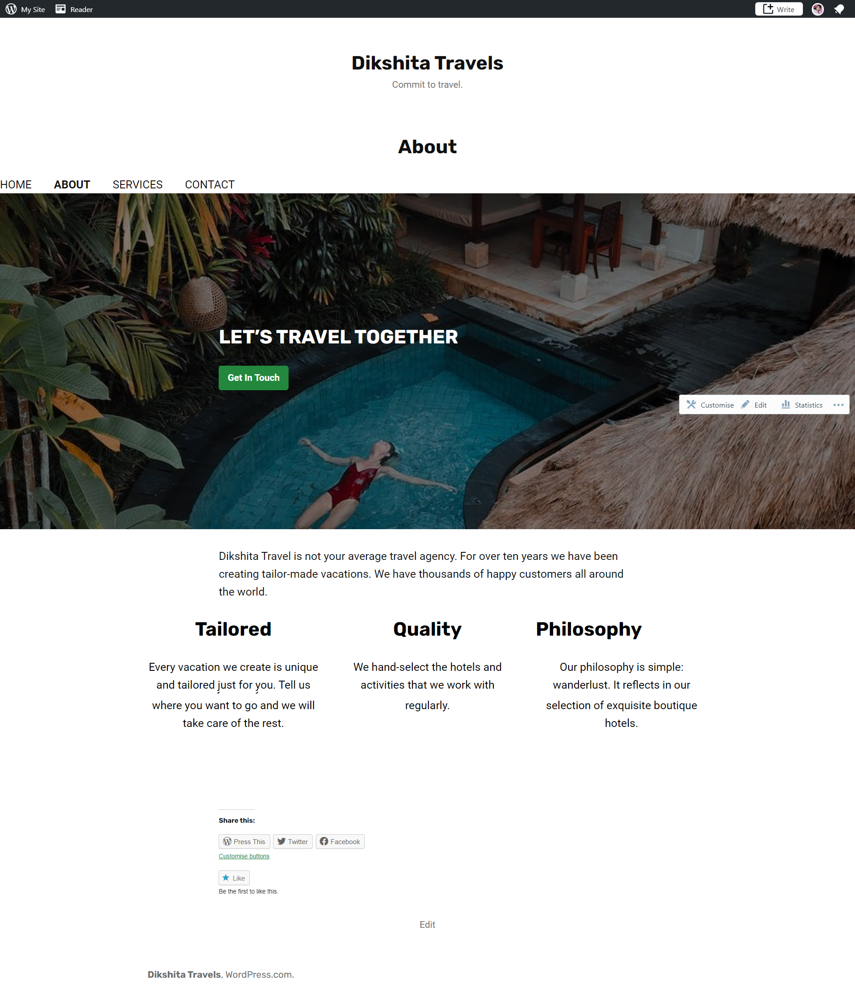

<h1 align="center">Wordpress Website</h1>

I have created a WordPress website for practice. I have used a free domain and plan free plan for this project.

<h3>My website - <a href="https://dikshitakambri434013655.wordpress.com/">Dikshita- Travels and Tours</a></h3>

<h4>Theme Used</h4>
<ul>
    <li>Exford</li>
</ul>

 

    
Home

    
About

    
Services

    
Contact

 